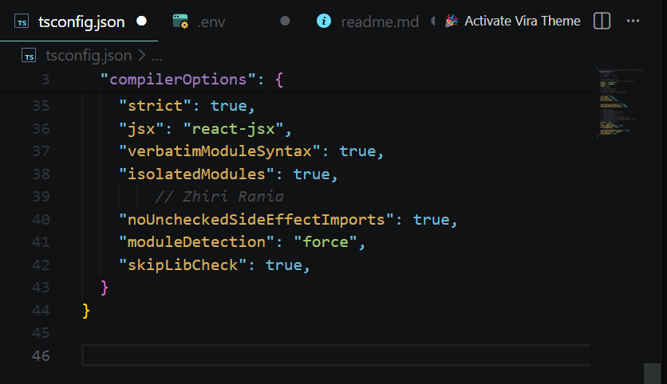
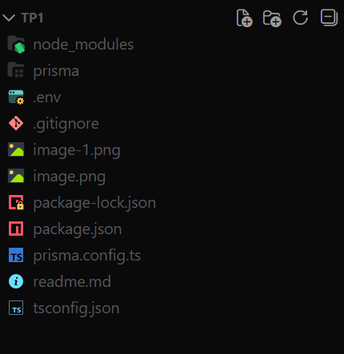
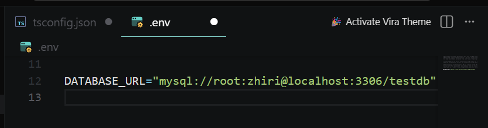
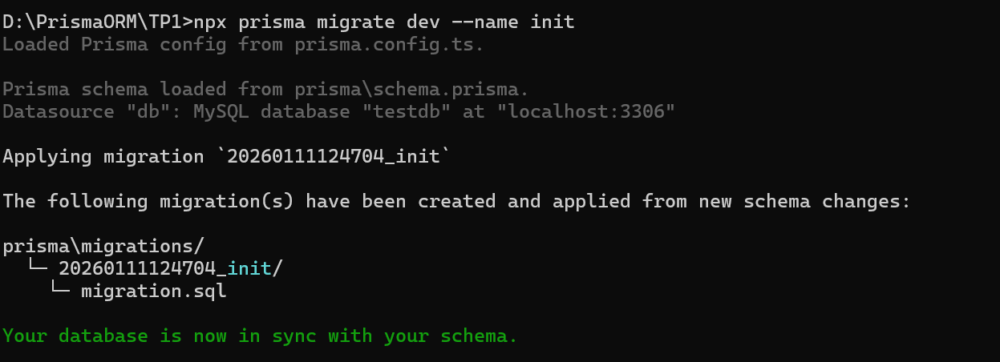
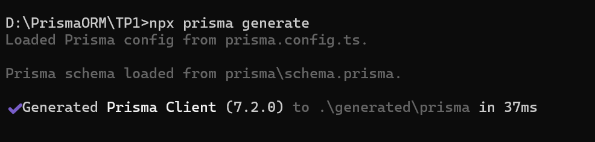

## Étape 1 – Vérifier et installer Node.js

1. Vérifiez si Node.js est déjà installé :
   Dans le terminal :
       - node -v
       - npm -v

Si Node.js n’est pas présent :
2. Téléchargez Node.js :
   - Rendez-vous sur https://nodejs.org
   - Choisissez la version LTS (Long Term Support).
   - Suivez l’installateur.

3. Vérifiez à nouveau après installation :
    - node -v
    - npm -v

## Étape 2 – Créer un dossier de projet

1. Créez un dossier vide :
mkdir mon-projet-prisma-mysql
cd mon-projet-prisma-mysql

2. Initialisez un projet Node.js :
npm init -y
Cette commande crée un fichier package.json qui contiendra vos dépendances et scripts.

## Étape 3 – Installer TypeScript

## Étape 4 – Installer Prisma
1. Installez Prisma CLI et le client Prisma :

    npm install --save-dev prisma
    npm install @prisma/client

## Étape 5 – Initialiser Prisma
1. Lancez l’initialisation :
   - npx prisma init

Résultat :

## Étape 6 – Configurer la connexion MySQL

## Étape 7 –  Créer la migration

## Étape 8 – Générer le client Prisma

